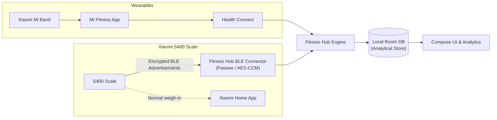

# Fitness Hub

[](https://github.com/HebaDenys/fitness-hub/actions/workflows/android.yml)

A local-first, privacy-focused Android application for health metrics, body composition, activity, sleep, nutrition, and workout analytics.

> [!WARNING]
> **Early Test Build**: Fitness Hub is currently in active pre-alpha development. The application ID has changed to `io.github.hebadenys.fitnesshub`; if you previously installed an "Open Health Hub" build, please uninstall it prior to installing this version.

---

## Why

Personal health data is routinely fragmented across proprietary apps and locked behind mandatory cloud accounts or subscriptions. Fitness Hub unifies this data into a single local analytical store under your control.

- **Local-first & offline-first**: No mandatory accounts, cloud backends, advertisements, or tracking SDKs.
- **Data sovereignty**: You own your health data; encrypted backup/restore and CSV export are already available locally.
- **Zero fabricated data**: Missing measurements remain `null` or unavailable; estimated values (e.g., body composition derived from impedance) are explicitly tagged with algorithm provenance.
- **Isolated connectors**: Hardware and external services interface through decoupled adapters.
- **Optional AI**: Any future machine learning or LLM assistance is strictly opt-in and never required for core operation.

---

## Features & Status

| Feature / Component | Status | Details |
|---|---|---|
| **Architecture Foundation** | Implemented | Single-module skeleton with Kotlin, Jetpack Compose, Material 3, Hilt, Room SQLite, and Navigation. |
| **Health Connect Ingestion** | Partial (prototype) | Reads steps, distance, active/total calories, resting HR (latest), SpO2 (latest), weight, body fat, sleep duration, and exercise sessions with Health Connect deduplication. *M1 hardening fixes missing value handling (`null` vs `0`), granular permissions, midnight sleep attribution, HR series, and provenance.* |
| **User Interface** | Partial (prototype) | Basic screens for Dashboard, Activity, Sleep, Body, and Settings. *M2 will introduce the complete Material 3 design system, charts, and metric breakdown cards.* |
| **Background & Incremental Sync** | Implemented (prototype) | Periodic WorkManager sync plus Health Connect Changes-token ingestion with fallback synchronization. |
| **Xiaomi S400 Scale Connector** | Partial (prototype) | Passive local BLE capture for future weigh-ins plus SmartScaleConnect-compatible CSV import for existing Xiaomi Home history. Multi-user CSVs require an explicit user filter. |
| **Nutrition Tracking** | Implemented (prototype) | Local food database, CameraX barcode flow, on-device label OCR, manual entry, optional Open Food Facts lookup and local caching. |
| **Training & Workout Tracking** | Implemented (prototype) | Custom exercises, sessions, sets/reps/load, RPE/RIR, rest timing, estimated 1RM and personal-record detection. |
| **Cross-Domain Analytics** | Partial (prototype) | Rolling trends and cross-domain correlation cards for weight/calories and sleep/training volume. Correlation is explicitly not presented as causation. |
| **Encrypted Backup & Restore** | Implemented (prototype) | Passphrase-derived AES-256-GCM backup/restore, Android file picker integration and CSV export. |
| **Optional AI Estimations** | Partial (prototype) | BYOK provider configuration, encrypted API-key storage, payload review and opt-in request transport. Core app remains independent of AI. |

---

## Supported Devices & Data Flows



- **Xiaomi Mi Band**: Synchronizes activity, sleep, heart rate, and workouts via the official Mi Fitness app into Android Health Connect, which Fitness Hub imports locally.
- **Xiaomi Body Composition Scale S400** uses two complementary paths:
  - **Existing history**: export Xiaomi Home data to CSV with [SmartScaleConnect](https://github.com/AlexxIT/SmartScaleConnect), then import the CSV from Fitness Hub Settings. Multiple users are never merged automatically.
  - **Future/live weigh-ins**: passive local BLE reception of encrypted MiBeacon advertisements (AES-CCM), while Xiaomi Home remains usable.
  - See [docs/connectors/xiaomi-s400.md](docs/connectors/xiaomi-s400.md) for protocol and privacy details.

---

## Install the Test APK

Automated test builds are generated on every push to the repository:

1. Download the latest debug APK from the rolling [test-latest prerelease](https://github.com/HebaDenys/fitness-hub/releases/tag/test-latest).
2. Install the APK on your Android device (ensure "Install unknown apps" permission is granted for your browser or file manager).
3. If upgrading from an older "Open Health Hub" build, uninstall the old app first to accommodate the updated package identifier (`io.github.hebadenys.fitnesshub`).

---

## Setup

1. **Verify Health Connect**: Built into Android 14+. On Android 9 through 13, install [Health Connect](https://play.google.com/store/apps/details?id=com.google.android.apps.healthdata) from Google Play.
2. **Configure Companion App**: In your wearable companion app (e.g., Mi Fitness), enable data synchronization to Health Connect.
3. **Grant Permissions**: Open Fitness Hub, navigate to **Settings**, tap **Grant permissions**, and approve the requested read permissions.
4. **Initial Sync**: Tap **Sync now** to perform your first health data import.

---

## Build from Source

**Requirements:**
- JDK 21 (Gradle 8.13 does not support running on JDK 25)
- Android SDK Platform 36 (Build-Tools 35.x or 36.x)

```bash
# Linux / macOS
./gradlew testDebugUnitTest lintDebug assembleDebug

# Windows (PowerShell)
.\gradlew.bat testDebugUnitTest lintDebug assembleDebug
```

The resulting debug APK is located at `app/build/outputs/apk/debug/app-debug.apk`.

---

## Architecture

Fitness Hub is structured as a single Android Gradle module with strict internal package boundaries (`core/database`, `core/healthconnect`, `core/sync`, `core/model`, `feature/*`, `di`). Room serves as the local analytical data store, while Health Connect functions as an interoperability layer. External devices interact exclusively through decoupled connector interfaces.

For design patterns, data models, and idempotency guarantees, see [docs/ARCHITECTURE.md](docs/ARCHITECTURE.md).

---

## Privacy

Fitness Hub contains:
- No backend server
- No user accounts or login systems
- No advertising networks
- No behavioral analytics or telemetry SDKs

All health records reside strictly on your device. Future local secrets (such as the S400 BLE bindkey, Phase 4) will be stored encrypted via Android Keystore.

---

## Medical Disclaimer

Fitness Hub is designed for personal fitness tracking and wellness informational purposes only. It is not a medical device, does not provide medical diagnoses or treatment recommendations, and must not replace professional healthcare consultation. Statistical trends and correlations displayed by the app reflect mathematical associations, not clinical causation.

---

## Roadmap

- **M0**: Rename, documentation overhaul, Gradle wrapper toolchain.
- **M1**: Phase 2 hardening (null handling, granular permissions, midnight sleep attribution, HR series, provenance, KSP, Room schemas).
- **M2**: UI foundation (Material 3 design system, Vico charts, trend cards).
- **Implemented prototypes**: nutrition, S400 BLE + Xiaomi history import, workout tracking, cross-domain analytics, encrypted backup, CSV export, and optional BYOK AI.
- **Current focus**: stabilization, real-device validation, data-integrity hardening, UX completion, and release-readiness/security verification.
- **Future expansion**: additional device connectors, deeper analytics, richer report export, and direct vendor integrations only where licensing/privacy allow it.

For detailed scope and completion criteria, consult [docs/ROADMAP.md](docs/ROADMAP.md).

---

## Contributing

Contributions are welcome. Please read [CONTRIBUTING.md](CONTRIBUTING.md) for code standards, testing practices, and guidelines on architectural constraints.

---

## License

**License: TBD**

The intended licensing model is source-available and free for personal, non-commercial use, with commercial usage governed by a separate license (evaluating PolyForm Noncommercial 1.0.0 and Business Source License 1.1). A Contributor License Agreement (CLA) will likely be required for external contributions. Until an explicit license file is published in the repository, all rights are reserved by default.

---

## Sustainability

Fitness Hub is committed to keeping core personal tracking completely free and local-first. For our planned sponsorship and sustainability framework, see [docs/SUSTAINABILITY.md](docs/SUSTAINABILITY.md).
