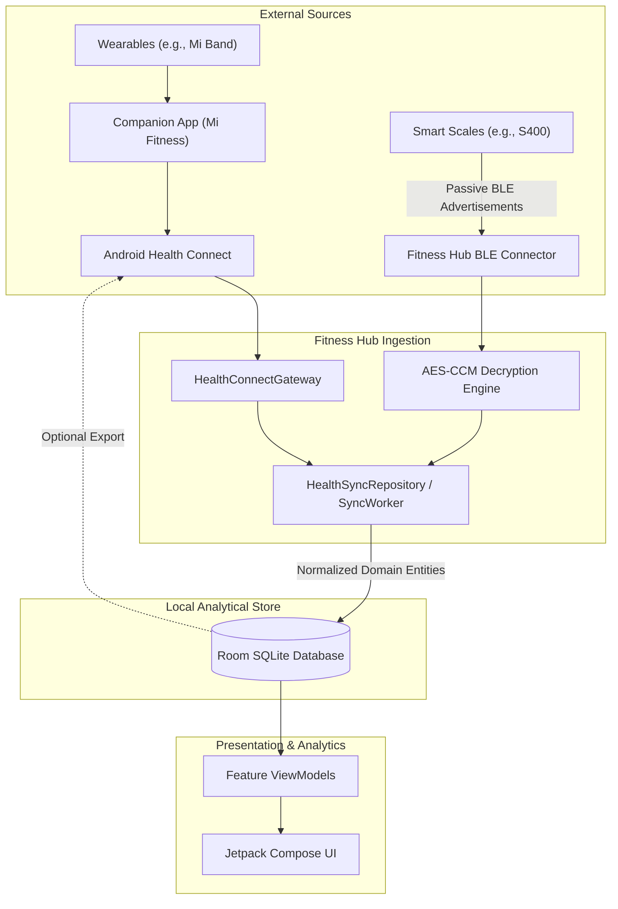
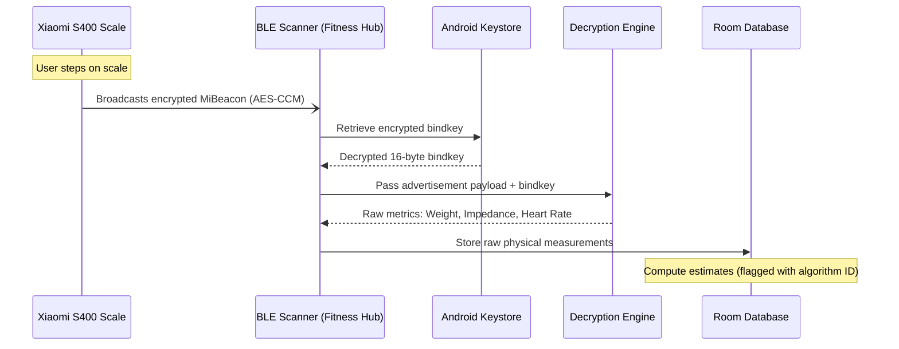

# Fitness Hub — System Architecture

This document describes the architectural principles, module structure, data flows, and security guidelines governing Fitness Hub.

---

## 1. Architectural Strategy

Fitness Hub adheres to a **local-first**, **privacy-first** design. Key architectural constraints include:

- **Single Gradle Module**: The application intentionally uses a single Android Gradle module (`app`) to avoid premature multi-module build overhead and complex dependency graphs during early development.
- **Strict Package Boundaries**: Architectural layering is enforced through directory and package isolation rather than separate build modules.
- **Room as the Source of Truth**: The local Room SQLite database serves as the primary analytical store. All analytics, history, and user interfaces read directly from Room.
- **Health Connect as an Interoperability Layer**: Android Health Connect is treated as an external shared data bus for synchronizing across apps and devices—not as the application's sole persistence mechanism.

---

## 2. Package Boundaries & Layering

The codebase is structured around core infrastructure and domain-specific features:

```
io.github.hebadenys.fitnesshub
├── core
│   ├── database          # Room database, DAOs, entities, converters, migrations
│   ├── healthconnect     # Health Connect API gateway, permission contracts, mappers
│   ├── sync              # Synchronization coordinators, WorkManager jobs, change tokens
│   └── model             # Target structure (M1): Pure domain entities (DailySummary, etc.)
├── feature               # Target structure (M1): UI screens and ViewModels
│   ├── dashboard         # Unified daily status card views
│   ├── activity          # Steps, distance, and active calorie breakdowns
│   ├── sleep             # Sleep stages, nocturnal sessions, and resting HR
│   ├── body              # Weight, impedance, body composition trends
│   └── settings          # Health Connect permissions, sync options, hardware keys
└── di                    # Hilt dependency injection modules
```

> [!NOTE]
> **Target Structure (M1)**: The prototype housed minimal screens within `MainActivity.kt`. Milestone M1 separates presentation into dedicated `feature/*` packages and decouples UI state from database entities via pure `core/model` domain models.

---

## 3. Data Flow Architecture



1. **Ingestion**: Raw external inputs arrive through Health Connect or direct device connectors (e.g., BLE).
2. **Normalization**: Connectors transform vendor-specific or platform-specific records into normalized domain data structures.
3. **Persistence**: Ingestion repositories write to Room utilizing conflict resolution strategies.
4. **Presentation**: Compose UI components reactively observe Room queries via Kotlin Coroutines `Flow`.

---

## 4. Idempotency & Deduplication

To prevent duplicate records and corrupted statistics during recurring synchronizations, Fitness Hub enforces strict idempotency:

| Data Type | Primary / Unique Key | Conflict Strategy |
|---|---|---|
| **Daily Aggregates** (`DailyHealthEntity`) | Calendar Date (`LocalDate` formatted as `YYYY-MM-DD`) | `OnConflictStrategy.REPLACE` (upsert based on latest sync). |
| **Exercise Sessions** (`ExerciseEntity`) | Health Connect record ID (`externalId` UUID) | `OnConflictStrategy.IGNORE` (prevent duplicate insertions). |
| **Sleep Sessions** (`SleepSessionEntity`) | Source metadata ID or start timestamp | Session attributed to wake day; unique on external ID. |
| **Direct Scale Readings** | Hardware MAC + epoch measurement timestamp | Unique index; duplicate broadcasts discarded immediately. |

---

## 5. Data Provenance & Integrity Model

To uphold the core rule: **Never fabricate health measurements**:

1. **Nullability over Placeholders**: Missing values or metrics for which permissions are denied are represented as `null`. They are never defaulted to `0` or synthetic values.
2. **Origin Tracking**: Every stored record and aggregate captures its provenance via `dataOrigin` (e.g., `com.mi.health`, `s400_ble_direct`, `user_manual`).
3. **Algorithm Provenance for Estimates**: Physical scales often measure only raw weight and impedance. Derived body composition indices (body fat %, lean mass, water %) must be calculated using published community formulas and tagged explicitly:
   - `provenance = ESTIMATE`
   - `algorithm = "openScale_v1"` or `"bodymiscale_v1"`
   - UI views display an "Estimate" badge alongside any computed metrics.

---

## 6. Connector Contract

Every external hardware device or platform integration must adhere to the isolated Connector Contract:

- **Interface Isolation**: Connectors must implement a decoupled interface (e.g., `HealthSourceConnector`). No connector may access the UI or ViewModel layer directly.
- **Normalization Boundary**: Connectors are responsible for sanitizing vendor payloads, verifying checksums, decrypting packets, and outputting normalized domain records with timestamps and source origins.
- **Local Autonomy**: Connectors must not require third-party cloud accounts or external backend infrastructure unless explicitly approved and architecturally isolated.

---

## 7. Xiaomi S400 BLE Connector Flow

The planned Xiaomi S400 integration operates entirely locally through passive Bluetooth Low Energy (BLE) scanning:



- **Zero Pairing Conflict**: The scale continues normal operation with Xiaomi Home because Fitness Hub does not establish an exclusive GATT connection.
- **Keystore Security**: The user's 16-byte `bindkey` is stored encrypted via the Android Keystore (AES-256-GCM). The app never solicits or stores Xiaomi cloud login credentials.

---

## 8. Privacy & Logging Standards

Health metrics represent sensitive personal data. The application enforces strict operational boundaries:

- **No Remote Telemetry**: No telemetry, analytics, or behavioral tracking SDKs are integrated into the codebase.
- **No Health Data in Logs**: System logs (`android.util.Log` or internal wrappers like `AppLogger`) must **never** record actual health values (such as weight, steps, heart rate, or sleep hours).
- **Structured Operation Logs**: Logging is restricted to operational lifecycle events, synchronization durations, record counts, and sanitized error classes, contextualized by a unique `syncId` correlation token.
