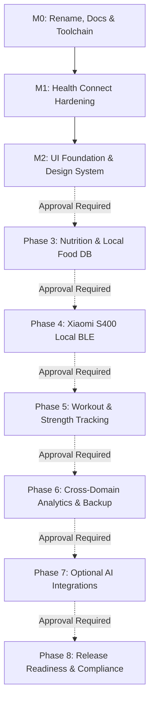

# Fitness Hub — Product Roadmap

This document outlines the evolutionary milestones and feature phases for Fitness Hub. 

> [!IMPORTANT]
> Per [AGENTS.md](../AGENTS.md), development proceeds sequentially. Milestone **M0** and **M1** cover foundational stabilization. **Every phase from Phase 3 onward requires explicit user approval before implementation begins.**

---

## Milestone Overview

---

## Milestone M0: Project Rename, Documentation & Toolchain

Refactor repository identity and establish reproducible build infrastructure.

### Scope
- Rename root project and namespace from `com.openhealthhub.app` to `io.github.hebadenys.fitnesshub`.
- Reorganize and rewrite repository documentation to strictly reflect codebase reality.
- Introduce official Gradle 8.13 wrapper (`gradlew`, `gradlew.bat`, wrapper jar and properties).
- Update GitHub Actions workflow to leverage `./gradlew` and publish version-aligned debug APKs.

### Done When
- [x] Application compiles cleanly under the new `io.github.hebadenys.fitnesshub` application ID.
- [x] Automated CI builds pass `./gradlew testDebugUnitTest lintDebug assembleDebug`.
- [x] All documentation links resolve and describe actual project status accurately.

---

## Milestone M1: Phase 2 Hardening (Health Connect Integration)

Resolve known edge cases and structural limitations in the initial Health Connect prototype before adding new domain features.

### Scope
- **Null Handling over Zero Default**: Replace zero-default metrics with nullable properties (`Long?`, `Double?`) in `DailySummary` and persistence models. The UI explicitly differentiates between recorded zero, missing data, and permission denied.
- **Granular Permissions**: Replace all-or-nothing checks (`containsAll`) with per-metric evaluation (`grantedMetrics()`). Partial permission grants import available metrics without failing the entire synchronization.
- **Permissions Rationale Activity (Android 14+)**: Implement `PrivacyRationaleActivity` responding to `androidx.health.ACTION_SHOW_PERMISSIONS_RATIONALE` and register the `android.intent.action.VIEW_PERMISSION_USAGE` activity-alias.
- **Nocturnal Sleep Attribution**: Attribute sleep sessions to the waking calendar day (`endTime` in local time) across noon-to-noon windows (`[Day - 1 12:00, Day 12:00)`), avoiding double-counting nights crossing midnight.
- **Vitals & Heart Rate Series**: Ingest continuous heart rate series; persist all daily readings for SpO2 and resting heart rate rather than relying on arbitrary `lastOrNull` snapshots.
- **Data Provenance & Source Tracking**: Store `metadata.dataOrigin.packageName` for all individual records and daily aggregates. Flag estimated metrics with explicit algorithm tags.
- **Background & Incremental Synchronization**: Implement WorkManager `SyncWorker` for periodic background sync. Utilize Health Connect Changes tokens stored in DataStore to ingest only modified records; fallback to full range sync on token expiration.
- **Historical Data Range**: Provide optional `READ_HEALTH_DATA_HISTORY` support for importing records older than 30 days.
- **Toolchain Modernization & Database Versioning**: Migrate annotation processing from `kapt` to `ksp`. Enable Room schema export (`exportSchema = true`) to version-tracked `app/schemas` directory, bumping the database to version 2 with clean migration strategies.
- **Traceable Structured Logging**: Introduce `AppLogger` with unique `syncId` correlation IDs. Strictly guarantee that **no personal health metrics** are printed to system logs.
- **Unit Testing**: Implement JVM-based unit tests using JUnit 5 and `mockito-kotlin` (`DailySummaryMapperTest`, `SleepAttributionTest`, `PermissionFilterTest`, `HealthSyncRepositoryTest`, `ExerciseDedupTest`). Remove placeholder assertions.

### Done When
- Background and incremental syncs execute reliably without data duplication.
- Granting a subset of permissions imports authorized data successfully.
- Sleep spanning midnight attributes accurately to the wake date.
- All JUnit 5 test suites pass in CI and locally.
- Room schemas are exported and tracked in version control.

---

## Milestone M2: UI Foundation & Design System

Establish a responsive, accessible, and informative presentation layer.

### Scope
- **Material 3 Design System**: Dynamic color palettes (Material You), dark/light mode optimization, and consistent typography hierarchy.
- **Chart Visualizations**: Integrate a lightweight, performant Android chart library (Vico) for daily, 7-day, 30-day, and 90-day metric trends.
- **Dashboard Metric Cards**: Modular summary cards for activity, sleep duration, resting heart rate, and body composition with baseline delta indicators.
- **State Handling**: Uniform representation across all screens for loading, empty state, permission missing, and sync error conditions.
- **Localization & Accessibility**: Bilingual support (English and Italian); comprehensive accessibility labeling and scalable typography.

### Done When
- All screens handle empty, partial, and full data states gracefully with visual parity across themes.
- Trend graphs render multi-week data without UI stutter.
- UI screenshots and visual component guides are updated in the documentation.

---

## Phase 3: Nutrition & Local Food Database ⚠️

> [!WARNING]
> Requires explicit approval prior to commencement.

Provide local-first dietary logging without mandatory dependencies on external commercial APIs.

### Scope
- **Local Food Database**: On-device SQLite store for food items, nutritional values (calories, macros, micronutrients), serving sizes, and user-defined recipes.
- **On-Device Barcode Scanner**: Local barcode detection utilizing CameraX and on-device ML Kit / ZXing.
- **Nutrition Label OCR**: Camera capture of nutritional labels with on-device text recognition to automatically parse caloric and macronutrient tables.
- **Local Product Learning**: Scan an unknown barcode, photograph the nutrition table, confirm parsed fields once, and persist it locally for future offline reuse.
- **Open Food Facts Connector**: Optional, opt-in network lookup for product barcodes against the open Open Food Facts database with local caching.
- **Health Connect Export**: Optional export of meal nutritional totals to Health Connect as `NutritionRecord`.

### Done When
- A user can scan an unknown food product barcode offline, photograph the nutritional label, confirm values via UI, and reuse the saved item in meal logs without internet connectivity.
- Meal nutritional totals calculate accurately and optionally sync to Health Connect.

---

## Phase 4: Xiaomi Body Composition Scale S400 (Local BLE) ⚠️

> [!WARNING]
> Requires explicit approval prior to commencement.

Direct, passive wireless reception of Xiaomi S400 scale measurements without Xiaomi cloud involvement.

### Scope
- **Passive BLE Advertisement Reception**: Background/foreground BLE scanning to capture encrypted Xiaomi MiBeacon v5 broadcast packets emitted during weigh-ins.
- **Cryptographic Decryption**: Decrypt broadcast payloads using AES-128-CCM with a user-supplied 16-byte `bindkey`.
- **Hardware Keystore Integration**: Store the scale `bindkey` encrypted at rest using the Android Keystore.
- **Physical Metric Ingestion**: Extract authenticated raw measurements: weight (kg), bioelectrical impedance (Ohms), heart rate (bpm), and user profile slot.
- **Body Composition Estimation Engine**: Estimate body fat percentage, lean mass, body water, and visceral fat using validated open-source algorithms (openScale / bodymiscale formulas).
- **Provenance & Transparency**: Strictly flag all derived body composition values as `ESTIMATE` with the corresponding algorithm identifier. Raw impedance is permanently archived.
- **Health Connect Export**: Optional export of weight, body fat, and basal metabolic rate records to Health Connect.

### Done When
- A real weigh-in on physical S400 hardware is intercepted passively, decrypted via the saved bindkey, and recorded into the local database while Xiaomi Home remains paired.
- Calculated body composition metrics are clearly marked as estimates in both the database and user interface.

---

## Phase 5: Workout & Strength Training Tracking ⚠️

> [!WARNING]
> Requires explicit approval prior to commencement.

A comprehensive, local workout logger for resistance training, bodybuilding, calisthenics, and cardio.

### Scope
- **Exercise Library**: Built-in default exercise database with full support for user-created custom movements, muscle group tagging, and equipment classification.
- **Workout Execution Logger**: Track active sessions with sets, repetitions, load (kg/lbs), Rate of Perceived Exertion (RPE), and Reps in Reserve (RIR).
- **Rest Timers & Templates**: Integrated rest interval notifications and reusable workout routines.
- **Strength Analytics & PRs**: Automatic personal record detection (1RM, 3RM, volume PRs) and 1RM estimations via Epley and Brzycki equations.
- **Health Connect Integration**: Export completed training workouts as `ExerciseSessionRecord` with associated activity types.

### Done When
- A full resistance training session can be logged offline, calculating estimated 1RMs and updating personal records without latency or network requirements.

---

## Phase 6: Cross-Domain Analytics, Reports & Encrypted Backup ⚠️

> [!WARNING]
> Requires explicit approval prior to commencement.

Derive actionable insights across nutrition, activity, sleep, and physical performance.

### Scope
- **Cross-Domain Correlations**: Correlate caloric intake vs. scale weight trends, sleep duration/stages vs. workout strength output, and active energy expenditure vs. dietary targets.
- **Statistical Integrity**: Prominent "correlation is not causation" advisory; rolling moving averages (7-day and 14-day exponential smoothing) to filter fluid weight fluctuations.
- **Exportable Reports**: Generate formatted PDF summaries and raw CSV datasets for personal archiving or consultation with trainers/physicians.
- **Encrypted Local Backup & Restore**: Full database backup encrypted with user passphrase using AES-256-GCM. Lossless import across device migrations.

### Done When
- Encrypted database backup can be created, transferred to another device, and restored losslessly with checksum validation.
- Cross-domain analytical cards render statistically smoothed trend charts.

---

## Phase 7: Optional AI Integrations ⚠️

> [!WARNING]
> Requires explicit approval prior to commencement.

Opt-in machine learning enhancements that preserve local-first principles.

### Scope
- **Natural Language Meal & Workout Entry**: Parse unstructured text inputs (e.g., "3 eggs, 50g oats, black coffee") into structured food or exercise logs.
- **Visual Meal Estimation**: Analyze food photographs to estimate meal components and portion sizes.
- **Bring Your Own Key (BYOK)**: User configures personal API credentials for supported LLM providers (e.g., OpenAI, Google Gemini, Anthropic) or local on-device models.
- **Data Privacy Disclosures**: Explicit confirmation modal displaying the exact JSON payload before any data leaves the device. Strictly disabled by default.

### Done When
- Core application operates 100% identically with AI features disabled.
- When enabled, full transparency of transmitted network data is displayed to the user prior to invocation.

---

## Phase 8: Release Readiness & Security Verification ⚠️

> [!WARNING]
> Requires explicit approval prior to commencement.

Prepare the application for distribution and formal public release.

### Scope
- **Licensing Finalization**: Apply chosen license (e.g., PolyForm Noncommercial 1.0.0 or BSL 1.1) and implement Contributor License Agreement (CLA) workflow.
- **Privacy Policy & Declarations**: Publish formal privacy policy compliant with Google Play Health Connect developer requirements.
- **Production Build Configuration**: Release signing configuration, R8 optimization and obfuscation rules, reproducible build verification.
- **Local Diagnostics**: On-device crash logging and diagnostic export without third-party tracking SDKs.
- **Security Audit**: OWASP Mobile Application Security Verification Standard (MASVS) checklist review, verifying Keystore usage, SQL injection prevention, and intent security.

### Done When
- Signed release AAB passes all lint, security, and R8 checks.
- Health Connect privacy and permissions verification requirements are fully met.
