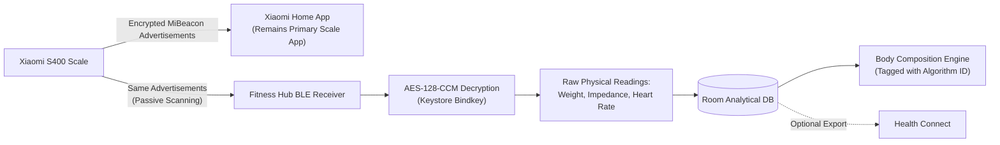

# Xiaomi Body Composition Scale S400 — Local BLE Integration

This document outlines the technical design, protocol analysis, cryptographic mechanisms, and operational constraints for integrating the **Xiaomi Body Composition Scale S400** into Fitness Hub.

---

## 1. Context & Architectural Strategy

The initial architectural concept considered a cloud-based integration with Xiaomi servers. Following technical evaluation, the strategy shifted to **direct, passive local BLE reception**:

### Why Cloud Integration Was Rejected
- **Privacy & Credential Security**: Storing Xiaomi cloud credentials or refresh tokens on-device introduces severe credential security risks.
- **API Fragility**: Xiaomi does not provide a public developer API for consumer scales; reverse-engineered cloud endpoints are prone to breaking changes and anti-bot restrictions.
- **Local-First Core Value**: Health tracking must remain operational without internet access or dependency on external vendor servers.

### Why App-to-App Integration Fails on Android
- **Sandbox Isolation**: Xiaomi Home stores measurements in its private application sandbox (`/data/data/com.xiaomi.smarthome`), which cannot be read by third-party apps without root access.
- **No Health Connect Export**: Xiaomi Home provides direct synchronization to Apple Health on iOS, but **does not write to Android Health Connect**.
- **Mi Fitness Incompatibility**: The S400 scale is not supported by Mi Fitness, eliminating the possibility of routing scale data through Mi Fitness into Health Connect.

### The Chosen Approach: Passive BLE Advertisement Reception
During a weigh-in, the S400 scale broadcasts Bluetooth Low Energy (BLE) advertisement packets formatted with the **Xiaomi MiBeacon v5** protocol. Fitness Hub listens for these packets passively, decrypts the payload locally using a user-provided encryption key (`bindkey`), and processes the metrics directly.

---

## 2. Protocol Details (MiBeacon v5 / AES-CCM)

The S400 broadcasts encrypted advertisements containing standard MiBeacon headers and encrypted event frames:

- **Advertising Service UUID**: `0xFE95` (Xiaomi Inc.)
- **Encryption Algorithm**: AES-128-CCM (Counter with CBC-MAC).
- **Packet Structure**:
  - Frame Control (flags defining encrypted payload, version, auth mode)
  - Product ID (S400 hardware identifier)
  - Frame Counter (rolling counter for replay protection)
  - MAC Address (device identity)
  - Encrypted Payload (encrypted measurement events)
  - Message Integrity Check (MIC / authentication tag)

Because Fitness Hub operates via **passive BLE scanning**, it never establishes a two-way Bluetooth GATT connection or bonding state with the scale. This design prevents Bluetooth contention and allows Xiaomi Home to function normally alongside Fitness Hub.

---

## 3. Bindkey Acquisition & Key Management

Decryption of MiBeacon payloads requires a 16-byte hex key known as the `bindkey`.

### Obtaining the Bindkey
1. The user pairs the scale normally with the Xiaomi Home app once.
2. The user extracts the scale's `bindkey` from their Xiaomi account using a trusted community utility (such as [Xiaomi Cloud Tokens Extractor](https://github.com/PiotrMachowski/Xiaomi-cloud-tokens-extractor)).
3. The user pastes the extracted `bindkey` into Fitness Hub under **Settings > Scale Configuration**.

### Security Rules
- **No Cloud Transmission**: Fitness Hub **never** communicates with Xiaomi servers and never prompts for or stores Xiaomi account usernames or passwords.
- **Android Keystore Encryption**: The 16-byte `bindkey` is encrypted at rest using AES-256-GCM backed by the hardware-isolated Android Keystore.
- **No Secrets in Source Control**: Bindkeys are user-specific runtime configuration values and must never appear in test fixtures or code repositories.

---

## 4. Broadcast Data vs. Computed Indices

A critical technical distinction governs the data provided by the scale:

| Measurement Type | Metrics Available via BLE Broadcast | How Computed Indices are Handled |
|---|---|---|
| **Raw Physical Measurements** | • Weight (kg / lbs) • Bioelectrical Impedance (Ohms) • Heart Rate (bpm) • User Profile Slot ID | Broadcast directly by the scale hardware. These are authentic measurements and stored as ground truth. |
| **Derived Indices (~25 metrics)** | *Not broadcast over BLE* | Xiaomi's proprietary app computes body fat %, muscle mass, visceral fat, bone mass, body water, and BMR inside Xiaomi Home. These values never travel over the air. |

### Upholding "Never Fabricate Health Measurements"
To provide complete body composition analytics without fabricating vendor numbers:

1. Fitness Hub estimates body fat, lean mass, and related parameters from the raw impedance reading, user height, age, and sex using published, transparent scientific community formulas (following the established methodology of open-source projects like `openScale` and `bodymiscale`).
2. Every estimated metric is strictly persisted and displayed with explicit provenance:
   - Metric flagged with: `isEstimate = true`
   - Algorithm provenance attached: e.g., `algorithm = "bodymiscale_v1"`
3. The user interface clearly distinguishes raw physical readings from mathematical estimates.

---

## 5. Scope & Limitations

- **Setup Onward Only**: Passive BLE scanning captures only measurements taken after the scale is configured in Fitness Hub. Historical weigh-ins stored in Xiaomi Home's private database cannot be backfilled.
- **Multiple Users**: The broadcast is reported to include a user profile identifier. The exact range and assignment logic are **not yet verified** on real hardware. Fitness Hub must let the user select their own profile so weigh-ins from other household members are ignored.

---

## 6. Risks & Hardware Validation

Implementation of Phase 4 requires rigorous validation against physical hardware:

1. **Hardware / Firmware Variants**: Different regional models and variants (e.g., standard S400 single/dual frequency vs. S400 Pro) may structure MiBeacon frame counters, event IDs, or impedance encodings differently.
2. **Foreground App Interference**: If Xiaomi Home is actively open in the foreground during a weigh-in, it may initiate a GATT connection that silences BLE advertisement broadcasting.
3. **Validation Strategy**: Development must be validated with real packet traces (btsnoop logs and Wireshark captures) before finalizing the parser.

---

## 7. Interim Community Workaround

Users desiring S400 scale metrics in Fitness Hub prior to the completion of Phase 4 can utilize existing third-party bridge tools:

- Community tools (e.g., *MiScale Sync*) can receive S400 Bluetooth broadcasts and write weight and body fat measurements directly into **Android Health Connect**.
- Because Fitness Hub already reads weight and body fat records from Health Connect, these measurements will automatically appear in Fitness Hub during daily synchronization.

*(Note: Mentioned strictly as an available user option; Fitness Hub is not affiliated with nor officially endorsing third-party synchronizers.)*
