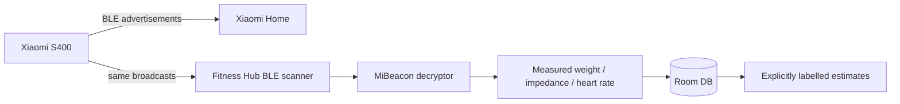

# Xiaomi Body Composition Scale S400 — Integration Strategy

Fitness Hub supports a **dual-path strategy** for Xiaomi Body Composition Scale S400 data:

1. **Historical measurements already stored in Xiaomi Home** are imported from a local CSV exported by SmartScaleConnect.
2. **Future/live weigh-ins** can be captured locally through the experimental passive BLE connector.

The objective is to keep Xiaomi Home usable while also maintaining a complete local Fitness Hub history.

---

## 1. Why two paths

A BLE listener can only observe measurements that occur while Fitness Hub is listening. It cannot reconstruct months of existing Xiaomi Home history.

Conversely, importing historical Xiaomi data once does not provide an automatic local path for future weigh-ins.

The two paths therefore solve different problems:

```text
Existing history:
S400 -> Xiaomi Home -> SmartScaleConnect export -> CSV -> Fitness Hub

Future/live:
S400 -> encrypted BLE advertisement -> Fitness Hub local connector
                                      \-> Xiaomi Home remains usable
```

Fitness Hub does **not** require the user to abandon Xiaomi Home.

---

## 2. Historical import

### Current supported workflow

Fitness Hub imports the CSV format produced by:

- [SmartScaleConnect](https://github.com/AlexxIT/SmartScaleConnect)

SmartScaleConnect is an independent MIT-licensed project that supports Xiaomi Home scale history, including the Xiaomi S400 EU model.

A normal exported CSV contains columns such as:

```text
Date,Weight,BMI,BodyFat,BodyWater,BoneMass,MetabolicAge,MuscleMass,
PhysiqueRating,ProteinMass,VisceralFat,BasalMetabolism,HeartRate,
SkeletalMuscleMass,User,Source
```

Fitness Hub currently imports the fields that map cleanly to its data model:

- timestamp
- weight
- heart rate
- body fat
- body water
- visceral fat
- basal metabolism
- source
- user identity for import isolation

Unsupported columns are ignored rather than invented or approximated.

### Multi-user safety

A physical S400 may be shared by several Xiaomi users.

If an imported CSV contains more than one distinct `User`, Fitness Hub **refuses to import the file automatically**.

The user must first choose the exact profile name. This prevents measurements belonging to different people from being silently merged into one local health history.

### Data provenance

Historical Xiaomi values are stored with:

```text
provenance = IMPORTED
algorithm = smartscaleconnect_csv
```

Vendor-provided body-composition values imported from history are not relabelled as Fitness Hub estimates.

---

## 3. Why Fitness Hub does not currently log into Xiaomi Cloud directly

Xiaomi does not provide a stable public consumer-scale API intended for third-party Android health applications.

Embedding Xiaomi credentials or long-lived reverse-engineered cloud tokens directly inside Fitness Hub would add:

- credential-security risk;
- vendor API fragility;
- authentication/anti-bot maintenance;
- additional privacy surface.

For the current architecture, the CSV bridge keeps Xiaomi authentication outside Fitness Hub while still allowing historical data to be recovered.

A direct Xiaomi-cloud connector may be evaluated later, but only if its authentication model, maintenance burden and licensing implications are acceptable.

Do **not** copy code from integrations whose license prohibits reuse in another application.

---

## 4. Passive BLE path for future weigh-ins

The experimental local connector listens for Xiaomi BLE service advertisements and attempts to decode S400 frames using the configured bindkey.

Current design:



The scanner is passive and does not intentionally open an exclusive GATT connection.

### Permissions

- Android 12+ requires runtime `BLUETOOTH_SCAN`.
- Older Android versions use the platform-required location permission for BLE scanning.

Fitness Hub requests the required permission only when the user starts scale listening.

---

## 5. Bindkey handling

The experimental encrypted BLE path requires the scale's 16-byte bindkey.

Rules:

- Fitness Hub does not ask for Xiaomi username/password.
- The bindkey is entered locally by the user.
- It is encrypted at rest through Android Keystore-backed storage.
- It must never be committed to source control or included in diagnostics.
- Removing the bindkey disables encrypted BLE decoding but does not remove imported historical measurements.

---

## 6. Raw measurements vs derived values

Fitness Hub distinguishes between three origins:

### Measured

Values directly observed from hardware or Health Connect.

```text
provenance = MEASURED
```

### Imported

Values exported from an existing source such as Xiaomi Home through the CSV bridge.

```text
provenance = IMPORTED
```

### Estimated

Values mathematically derived by Fitness Hub from raw measurements and a local user profile.

```text
provenance = ESTIMATE
algorithm = <explicit formula identifier>
```

Estimated values must never be shown as if Xiaomi or the hardware measured them directly.

---

## 7. Current limitations

The S400 integration remains a prototype and requires validation against real hardware/firmware.

Known constraints:

- BLE capture only covers future weigh-ins observed by the app.
- Historical import is currently a manual CSV workflow.
- Some Xiaomi metrics do not yet have first-class Fitness Hub fields.
- BLE frame formats may vary by regional model or firmware.
- Bindkey extraction still requires an external community tool.
- Background BLE behavior is subject to Android power-management restrictions.
- Direct Health Connect export of all scale-derived fields is not yet complete.

These limitations should be documented rather than hidden.

---

## 8. Validation checklist

Before calling the connector production-ready:

1. Validate BLE decoding on the actual target S400 hardware.
2. Verify Xiaomi Home remains usable during/after passive scanning.
3. Compare imported historical values against Xiaomi Home for multiple dates.
4. Test a shared scale with multiple user profiles.
5. Verify duplicate CSV imports remain idempotent.
6. Verify no user A measurement can appear in user B history.
7. Verify Android 12+ runtime Bluetooth permission behavior.
8. Verify no bindkey or health value is emitted to logs.
9. Test backup/restore of imported scale data.
10. Validate all exported Health Connect mappings separately.

---

## 9. Interoperability references

- SmartScaleConnect: https://github.com/AlexxIT/SmartScaleConnect
- Xiaomi MiBeacon ecosystem/protocol behavior should be treated as reverse-engineered and subject to firmware changes.

Fitness Hub is not affiliated with Xiaomi or SmartScaleConnect.
